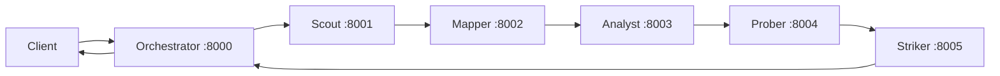

# Obsidia ReconAgent Pipeline

Obsidia is a local, service-oriented reconnaissance pipeline for authorized web
security assessments. Five specialist FastAPI services run in a fixed sequence,
and `agent-orchestrator` coordinates them over HTTP:



The stages have deliberately different responsibilities:

| Stage | Service | Port | Purpose |
| --- | --- | ---: | --- |
| Scout | `team1_agent-scout` | 8001 | Fingerprint liveness, technologies, WAF, headers, TLS, ports, and WordPress signals. |
| Mapper | `team2_agent-mapper` | 8002 | Enumerate routes, APIs, JavaScript, historical URLs, directories, source maps, and services. |
| Analyst | `team3_agent-analyst` | 8003 | Passively inspect discovered assets for secrets, endpoints, client-side weaknesses, and exposed configuration. |
| Prober | `team4_agent-prober` | 8004 | Safely validate promising findings and collect evidence. |
| Striker | `team5_agent-striker` | 8005 | Perform the final authorized impact assessment; real active tools are gated by HITL logic. |

## Repository layout

```text
.
├── agent-orchestrator/       # HTTP coordinator and pipeline context handling
├── team1_agent-scout/        # F1 fingerprinting specialist
├── team2_agent-mapper/       # F2 attack-surface enumeration specialist
├── team3_agent-analyst/      # Passive JavaScript/secrets/config analysis
├── team4_agent-prober/       # Active validation pipeline
├── team5_agent-striker/      # Final impact assessment specialist
└── README.md
```

Each service is an independent Python application with its own dependency file
and environment template. The service READMEs are the source of truth for
stage-specific details:

- [Orchestrator](agent-orchestrator/README.md)
- [Scout](team1_agent-scout/README.md)
- [Mapper](team2_agent-mapper/README.md)
- [Analyst](team3_agent-analyst/README.md)
- [Prober](team4_agent-prober/README.md)
- [Striker](team5_agent-striker/README.md)

## Common API contract

Every stage exposes a health endpoint and a task endpoint. The orchestrator uses
the same contract for all downstream services.

```http
GET /health
POST /agents/{agent_id}/tasks
Content-Type: application/json
```

Task requests contain:

```json
{
  "prompt": "Run the authorized reconnaissance pipeline.",
  "target": "https://example.test",
  "context": {}
}
```

Successful responses contain `agent_id`, `status`, and a `response` object. The
response normally contains a human-readable `summary` and a list of structured
`findings`. `context` is the handoff boundary: it carries earlier results and
discovered URLs into the next stage.

## Quick start

Use Python 3.10+ and create a separate virtual environment per service if the
dependencies conflict. Start the specialist services first, then the
orchestrator. In separate terminals:

```bash
cd team1_agent-scout
python3 -m venv .venv && source .venv/bin/activate
pip install -r requirements.txt
cp .env.example .env 2>/dev/null || true
TOOL_MOCK_MODE=true uvicorn main:app --reload --port 8001
```

Repeat the dependency installation for the other directories, using ports
`8002`, `8003`, `8004`, and `8005`. The orchestrator has a committed template:

```bash
cd agent-orchestrator
python3 -m venv .venv && source .venv/bin/activate
pip install -r requirements.txt
cp .env.example .env
uvicorn main:app --reload --port 8000
```

Then submit a pipeline task:

```bash
curl -X POST http://localhost:8000/agents/agent-orchestrator/tasks \
  -H 'Content-Type: application/json' \
  -d '{
    "prompt": "Run an authorized reconnaissance assessment and summarize the security posture.",
    "target": "https://example.test",
    "context": {}
  }'
```

Check service availability before running a pipeline:

```bash
for port in 8000 8001 8002 8003 8004 8005; do
  curl -fsS "http://localhost:${port}/health" || echo "port ${port} unavailable"
done
```

## Mock and real execution

Start with `TOOL_MOCK_MODE=true` while developing. Mock mode returns deterministic
fixture-like tool results and avoids requiring the external scanners. Setting it
to `false` makes the relevant service invoke binaries such as `httpx`, `nmap`,
`nuclei`, `sqlmap`, or `wpscan`; those binaries, their scripts, templates, and
network access must be installed separately as described by each service README.

LLM configuration is also per service. The common variables are:

| Variable | Meaning |
| --- | --- |
| `OLLAMA_BASE_URL` | OpenAI-compatible Ollama endpoint. |
| `OLLAMA_MODEL` | Model used for planning, ReAct decisions, or summaries. |
| `OLLAMA_API_KEY` | Credential for a hosted endpoint; local Ollama usually ignores it. |
| `TOOL_MOCK_MODE` | Select mock or real tool execution where supported. |

The orchestrator additionally accepts `SCOUT_URL`, `MAPPER_URL`, `ANALYST_URL`,
`PROBER_URL`, and `STRIKER_URL`, allowing services to run on different hosts or
ports.

## Pipeline behavior and safety

The orchestrator is instructed to call stages in this order:

```text
Scout → Mapper → Analyst → Prober → Striker
```

It passes accumulated context forward, truncates downstream summaries and
findings before returning them to the orchestrator model, and records unavailable
services as `skipped` so one failed stage does not automatically stop the run.
The Striker stage is intended for authorized targets only; in mock mode its
active-test approval path is automatically approved for demonstration.

This repository contains reconnaissance and security-testing automation. Use it
only against systems for which you have explicit permission, keep real mode
disabled during development, and treat all findings as leads that require human
review.

## Development notes

- Run commands from the service directory, because imports are written for local
  module execution (`uvicorn main:app`).
- Do not commit `.env` files, API keys, generated reports, caches, or downloaded
  external tool directories.
- The Scout `selector.py` is retained as a reference implementation; the live
  path is the LangGraph ReAct agent in `agent.py`.
- The Prober directory contains both the current FastAPI pipeline and extensive
  design/walkthrough documents under `docs/`.
- `team1_agent-scout/report.json` and `scanme_report.json` are example artifacts,
  not runtime inputs.

## Verification checklist

Before handing off a change:

1. Confirm `git status` and avoid staging local `.env` or generated files.
2. Compile the changed Python modules, for example:
   `python3 -m compileall agent-orchestrator team1_agent-scout team3_agent-analyst`.
3. Start the affected service in mock mode and exercise `/health`.
4. Send a small task to verify the response shape and context handoff.
5. For a full run, start all six services and inspect skipped stages as well as
   findings; a completed orchestration does not mean every stage was available.
