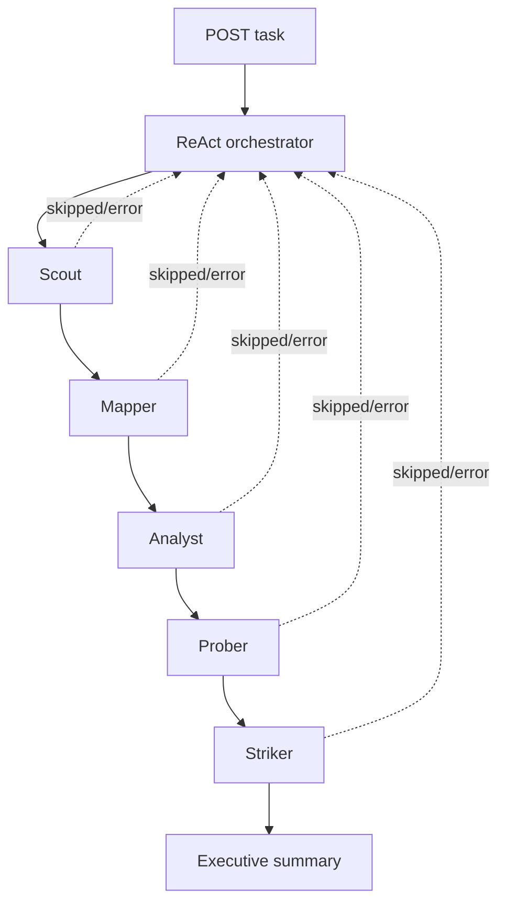

# Obsidia Agent Orchestrator

The orchestrator is the port-8000 FastAPI service that coordinates the five
specialist services. Its LangGraph ReAct agent calls one HTTP wrapper at a time,
passes prior results as context, and returns a single pipeline response.



## Pipeline contract

The intended order is strict:

```text
Scout → Mapper → Analyst → Prober → Striker
```

Each call is made to `/agents/{agent_id}/tasks` with `prompt`, `target`, and a
JSON `context` containing useful prior results. The downstream response is
normalized to `summary` plus `findings`; the tool wrapper truncates those fields
before returning them to the LLM to prevent context overflow on JavaScript-heavy
targets. The full downstream payload is not retained in the orchestrator's
model context once truncated.

Unavailable services are represented as `skipped: true`, and the pipeline is
designed to continue. The orchestrator also validates model-supplied target URLs
and restores the original request target if a model emits a malformed or
truncated value. The request target must still be a normal `http://` or `https://`
URL with a dotted host.

## Setup

```bash
cd agent-orchestrator
python3 -m venv .venv
source .venv/bin/activate
pip install -r requirements.txt
cp .env.example .env
uvicorn main:app --reload --port 8000
```

The specialist services should be started separately on ports 8001–8005. The
orchestrator can still start when some are down; those stages will be reported
as skipped when invoked.

## API

Health and configured downstream URLs:

```bash
curl http://localhost:8000/health
```

Run a task:

```bash
curl -X POST http://localhost:8000/agents/agent-orchestrator/tasks \
  -H 'Content-Type: application/json' \
  -d '{
    "prompt": "Run the authorized reconnaissance pipeline and summarize the security posture.",
    "target": "https://example.test",
    "context": {}
  }'
```

The response shape is:

```json
{
  "agent_id": "agent-orchestrator",
  "status": "completed",
  "response": {
    "summary": "...",
    "pipeline_results": {
      "scout": {"summary": "...", "findings": []},
      "mapper": {"summary": "...", "findings": []},
      "analyst": {"summary": "...", "findings": []},
      "prober": {"summary": "...", "findings": []},
      "striker": {"summary": "...", "findings": []}
    }
  }
}
```

If the request handler catches an unexpected exception, it returns `status:
failed` with an error in `response` rather than raising the exception through
FastAPI.

## Configuration

Copy `.env.example` and set the following values:

| Variable | Default | Purpose |
| --- | --- | --- |
| `SCOUT_URL` | `http://localhost:8001` | Scout base URL. |
| `MAPPER_URL` | `http://localhost:8002` | Mapper base URL. |
| `ANALYST_URL` | `http://localhost:8003` | Analyst base URL. |
| `PROBER_URL` | `http://localhost:8004` | Prober base URL. |
| `STRIKER_URL` | `http://localhost:8005` | Striker base URL. |
| `OLLAMA_BASE_URL` | `https://ollama.com/v1` | OpenAI-compatible model endpoint. |
| `OLLAMA_MODEL` | `gpt-oss:20b` | Orchestrator model. |
| `OLLAMA_API_KEY` | unset | Hosted endpoint credential. |

Downstream requests use a 400-second timeout. A read timeout is retried once
after a short delay; other connection, HTTP, and JSON errors become skipped
stage results. Tool results are limited to five Scout findings, three Mapper,
Analyst, Prober, and Striker findings, and stage-specific summary character
limits in `tools.py`.

## Implementation guide

- `main.py` defines FastAPI request/response models and the public routes.
- `agent.py` creates the LangGraph ReAct graph and extracts the final summary
  and per-agent tool messages.
- `tools.py` owns the registry, URL validation, HTTP calls, retry behavior,
  context forwarding, truncation, and health metadata.

To add a specialist, add a `@tool` wrapper, register it in `AGENT_REGISTRY`, and
update the system prompt/order rules. The registry drives both the health output
and the graph tool list, so these should not be maintained in separate places.

## Troubleshooting

- Check `/health` first; it shows the URLs the process actually loaded.
- If a stage is skipped, call that stage's `/health` and inspect its own logs.
- If the model supplies a shortened URL, the wrapper should recover the original
  request target; an invalid original target is rejected.
- A completed orchestration can contain skipped stages. Inspect every
  `pipeline_results` entry before treating the executive summary as complete.
- Never commit `.env`; `.gitignore` excludes it. Use mock mode in each specialist
  while developing and run real active stages only for explicitly authorized
  targets.
