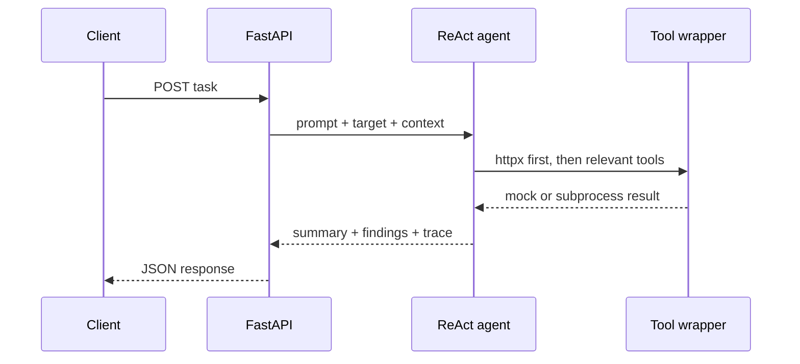

# Scout Agent — Team 1

`agent-scout` is the F1 fingerprinting service in the Obsidia pipeline. It
confirms that a target is reachable, identifies its technology and network
posture, and returns signals that Mapper and the orchestrator can use to plan
the next stage.

## Responsibilities

The live implementation is a LangGraph ReAct agent in `agent.py`. The model
chooses from seven allowlisted tools, reads each tool result, and stops when it
has enough evidence or reaches the graph recursion limit. `main.py` exposes the
HTTP API; `tools.py` provides mock/real wrappers; and
`parsers/httpx_parser.py` converts the shared httpx result into F1 signals.

The available tools are:

| Tool | Role |
| --- | --- |
| `httpx` | Verify liveness, status, title, server, and basic technology metadata. This is always the first check. |
| `whatweb` | Identify frameworks, CMSs, libraries, and server technologies. |
| `wafw00f` | Detect a WAF and vendor when possible. |
| `shcheck` | Inspect common HTTP security headers. |
| `testssl` | Inspect HTTPS protocols, certificate posture, and weak TLS indicators; skips plain HTTP. |
| `nmap` | Scan the top 100 TCP ports for exposed services. |
| `wpscan` | Enumerate WordPress only when WordPress is indicated or explicitly requested. |

`selector.py` contains the earlier keyword-based selector and is kept for
reference; it is not used by the current `main.py` request path.

## API

Start the service on port 8001:

```bash
uvicorn main:app --reload --port 8001
```

Health:

```bash
curl http://localhost:8001/health
```

Task:

```bash
curl -X POST http://localhost:8001/agents/agent-scout/tasks \
  -H 'Content-Type: application/json' \
  -d '{
    "prompt": "Fingerprint the target, identify its WAF and exposed services.",
    "target": "https://example.test",
    "context": {}
  }'
```

The request model requires non-empty `prompt` and `target`; `context` is optional
and is accepted for compatibility with the orchestrator. The response is:

```json
{
  "agent_id": "agent-scout",
  "status": "completed",
  "response": {
    "summary": "...",
    "findings": [],
    "reasoning_trace": []
  }
}
```

The exact finding fields are produced by the current agent synthesis, so callers
should read `summary` and iterate defensively over `findings` rather than assume
every tool has identical fields.

## Setup

```bash
cd team1_agent-scout
python3 -m venv .venv
source .venv/bin/activate
pip install -r requirements.txt
```

There is no committed `.env.example` in this directory. Environment variables
can be exported in the shell or placed in a local, ignored `.env` file:

```dotenv
TOOL_MOCK_MODE=true
OLLAMA_BASE_URL=http://localhost:11434/v1
OLLAMA_MODEL=qwen2.5
OLLAMA_API_KEY=ollama
```

`TOOL_MOCK_MODE` defaults to `true` in the wrappers. With mock mode enabled,
external scanner binaries are not required. With it disabled, install and put
the seven binaries/scripts on `PATH` (or adjust the wrappers) before testing
against an authorized target.

## Runtime flow



Tool failures are represented in the tool result and should not be confused
with a confirmed security finding. `health` reports the configured model,
endpoint, mock mode, and allowlist, which makes it the first troubleshooting
check when the service is running.

## Troubleshooting

- `ModuleNotFoundError`: run Uvicorn from this directory so `agent.py`,
  `tools.py`, and `parsers/` are importable.
- LLM connection errors: check `OLLAMA_BASE_URL`, `OLLAMA_MODEL`, and the API key
  if using a hosted endpoint; tool mock mode does not mock the LLM.
- Missing scanner errors: use `TOOL_MOCK_MODE=true` or install the real binary.
- HTTPS/TLS errors: Scout retries header checks without certificate verification
  only for an SSL error; treat that as a signal to review the target manually.
