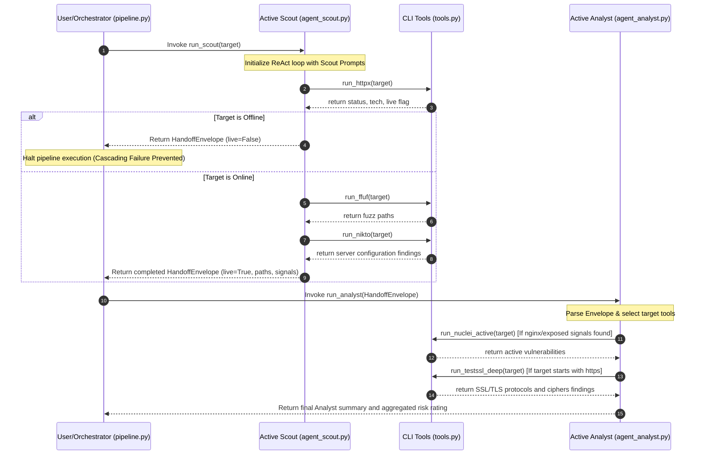

# reconagent-prober-pipeline

Welcome to the definitive, low-level technical architectural and mechanical specification for the **reconagent-prober-pipeline** (Team 4 - Active Prober Specialist Agent & Pipeline). 

This document details the **internal mechanics, codebase operations, data flow transformations, state machine states, and runtime execution loops** that power the system. It is written to provide a thorough technical walkthrough for senior engineers, security researchers, and system architect reviews.

---

## Table of Contents
1. [Core Architectural Design & System Topography](#1-core-architectural-design--system-topography)
2. [How All Components Tie Together (Pipeline Lifecycle)](#2-how-all-components-tie-together-pipeline-lifecycle)
3. [The ReAct (Reasoning + Action) Paradigm & Loop Mechanics](#3-the-react-reasoning--action-paradigm--loop-mechanics)
4. [LangGraph State Machine & Graph Execution Mechanics](#4-langgraph-state-machine--graph-execution-mechanics)
5. [Agent-Level Deep Dive & Verbatim Prompt Engineering](#5-agent-level-deep-dive--verbatim-prompt-engineering)
6. [Tool Execution Engine & Subprocess Lifecycle (tools.py)](#6-tool-execution-engine--subprocess-lifecycle-toolspy)
7. [Detailed Tool-by-Tool Command & Parser Specifications](#7-detailed-tool-by-tool-command--parser-specifications)
8. [Handoff Contract (HandoffEnvelope) Specifications](#8-handoff-contract-handoffenvelope-specifications)
9. [Deterministic Mock-LLM Engine Mechanics](#9-deterministic-mock-llm-engine-mechanics)
10. [FastAPI Endpoint Routing & Schema Validation](#10-fastapi-endpoint-routing--schema-validation)
11. [Failure Injection Mechanics & Break-Mode Dynamics](#11-failure-injection-mechanics--break-mode-dynamics)
12. [State Guarding & Proposed Orchestration Fix Logic](#12-state-guarding--proposed-orchestration-fix-logic)

---

## 1. Core Architectural Design & System Topography

In Day 21/22, we built a single **agent-prober** ReAct agent that exposed a FastAPI service on port 8004. In Day 23, we split that single agent's responsibilities into a **Multi-Agent Pipeline** consisting of two specialist sub-agents:

1.  **Active Scout (`agent_scout.py`)**: Focuses entirely on surface discovery, liveness checks, and path mapping.
2.  **Active Analyst (`agent_analyst.py`)**: Focuses on targeted vulnerability analysis and certificate/CORS checks based on Scout's discovery.

### System Diagram

```
                       [ User Prompt / Target ]
                                  │
                                  ▼
                     ┌──────────────────────────┐
                     │ pipeline.py (Orchestrator)│
                     └────────────┬─────────────┘
                                  │
                   (Target)       ▼
                     ┌──────────────────────────┐
                     │       Active Scout       │
                     │    (agent_scout.py)      │
                     └────────────┬─────────────┘
                                  │
                   Executes:      │ [Calls: httpx, ffuf, nikto]
                                  ▼
                     ┌──────────────────────────┐
                     │     HandoffEnvelope      │ (Structured JSON Gating Boundary)
                     └────────────┬─────────────┘
                                  │
             (Envelope)           ▼
                     ┌──────────────────────────┐
                     │      Active Analyst      │
                     │   (agent_analyst.py)     │
                     └────────────┬─────────────┘
                                  │
                   Executes:      │ [Calls: nuclei, testssl, corsy, kxss]
                                  ▼
                        [ Pipeline Output ]
```

### Logical Topology (Data Flows and Boundaries)

The pipeline isolates execution domains to prevent one agent from executing commands out of its security or operational scope:

```
┌─────────────────────────────────────────────────────────────────────────────────────────┐
│ HOST SYSTEM (CLI Binaries: httpx, ffuf, nikto, nuclei, testssl.sh, corsy, kxss)         │
└──────────────────────────────────────────▲──────────────────────────────────────────────┘
                                           │ Subprocess Spawns (tools.py)
┌──────────────────────────────────────────┴──────────────────────────────────────────────┐
│ PIPELINE ENGINE (pipeline.py)                                                           │
│                                                                                         │
│  ┌──────────────────────────────┐                 ┌──────────────────────────────┐      │
│  │   Active Scout (ReAct)       │                 │  Active Analyst (ReAct)      │      │
│  │                              │                 │                              │      │
│  │  - Context: Target URL       │                 │  - Context: HandoffEnvelope  │      │
│  │  - System Prompt: Discovery  ├─[Handoff JSON]─►│  - System Prompt: Auditing   │      │
│  │  - Allowlist: httpx, ffuf,   │                 │  - Allowlist: nuclei,        │      │
│  │               nikto          │                 │               testssl, corsy,│      │
│  │                              │                 │               kxss           │      │
│  └──────────────────────────────┘                 └──────────────────────────────┘      │
└─────────────────────────────────────────────────────────────────────────────────────────┘
```

---

## 2. How All Components Tie Together (Pipeline Lifecycle)

Data flows through the pipeline in a synchronous, staged sequence managed by `pipeline.py`:



### Complete Pipeline Run Data State Transition
1.  **State 0 (Input)**: Hostname/URL string is passed (`https://demo.testfire.net`).
2.  **State 1 (Discovery Execution)**:
    *   `httpx` returns a list of technologies (`['nginx']`) and sets `live=True`.
    *   `ffuf` finds path strings (`['/backup.zip', '/admin']`) and flags matching signals (`['exposed_admin_panel', 'backup_file']`).
    *   `nikto` checks for HTTP headers and flags `missing_security_headers`.
3.  **State 2 (Handoff Boundary)**: The parameters are structured into the `HandoffEnvelope` dictionary.
4.  **State 3 (Analysis Execution)**:
    *   The `HandoffEnvelope` JSON string is appended to the Analyst user prompt.
    *   The Analyst reads the `tech_stack` (`['nginx']`) and triggers `nuclei_active`.
    *   The Analyst reads the `target` scheme (`https`) and triggers `testssl_deep`.
    *   `nuclei_active` confirms vulnerability findings (e.g. `exposed_git` template match).
    *   `testssl_deep` confirms TLS protocol findings (e.g. `TLSv1` offered).
5.  **State 4 (Aggregation)**: The final security report is compiled with intent logs and severity levels.

---

## 3. The ReAct (Reasoning + Action) Paradigm & Loop Mechanics

ReAct (Reasoning + Action) is an LLM execution pattern where the LLM behaves as an agent that reasons about a problem, plans an intent, selects a tool, parses the tool's output, checks if the plan succeeded, and decides on its next action.

### The Detailed Step-by-Step ReAct Sequence
1.  **System Framing**: The LLM is provided with a system prompt detailing its role, allowed tools, and reasoning formats.
2.  **Thought Generation**: The model evaluates the current conversation history. It generates a "Thought" representing its reasoning:
    ```
    Thought: The target is verified live. I need to scan for directories to map the attack surface.
    ```
3.  **Intent Tracking**: The model explicitly defines a target for its next action:
    ```
    Intent: Find exposed files (such as backup archives or configurations) using ffuf.
    ```
4.  **Action Selection**: The model calls a tool by outputting a JSON object containing the tool function name and input parameters:
    ```json
    {
      "name": "run_ffuf",
      "arguments": { "target": "https://demo.testfire.net" }
    }
    ```
5.  **Observation**: The orchestration graph intercepts this output, suspends LLM execution, calls the Python tool function, and returns the result:
    ```json
    {
      "signal_candidates": ["backup_file"],
      "findings": [{"input": "backup.zip", "status": 200}],
      "errors": []
    }
    ```
6.  **Fulfilled Verification**: The LLM reads the result and declares whether its intent was satisfied:
    ```
    Fulfilled: True
    ```
7.  **Final Summary**: Once all intents are fulfilled, the model stops generating tool calls and returns a plain-text summary report.

### ReAct Loop Logical Flowchart
This diagram illustrates how the reasoning and action steps form a loop:

```
┌────────────────────────────────────────────────────────┐
│                   START REACT LOOP                     │
└──────────────────────────┬─────────────────────────────┘
                           │
                           ▼
             ┌───────────────────────────┐
             │   Generate LLM Message    │
             └─────────────┬─────────────┘
                           │
                           ├───────────────────────────────────────┐
                           │ (Contains Tool Call Request)          │ (Text response only)
                           ▼                                       ▼
             ┌───────────────────────────┐           ┌───────────────────────────┐
             │    Extract Tool & Args    │           │   Generate Final Report   │
             └─────────────┬─────────────┘           └─────────────┬─────────────┘
                           │                                       │
                           ▼                                       ▼
             ┌───────────────────────────┐                   ┌───────────┐
             │    Execute Shell Tool     │                   │   EXIT    │
             └─────────────┬─────────────┘                   └───────────┘
                           │
                           ▼
             ┌───────────────────────────┐
             │  Feed JSON to LLM Context │
             └───────────────────────────┘
```

---

## 4. LangGraph State Machine & Graph Execution Mechanics

We use **LangGraph** to construct the ReAct loop as a state machine. In LangGraph, the agent's context is treated as a state dictionary containing a list of messages.

### 1. State Schema & Message Logs
```python
class AgentState(TypedDict):
    messages: Sequence[BaseMessage]
```
The state accumulates the following message nodes:
*   `HumanMessage`: The user prompt.
*   `AIMessage`: Generated by the LLM, containing text (`Thought`, `Intent`, `Fulfilled`) and the tool invocation block (`tool_calls`).
*   `ToolMessage`: Appended by the execution node, containing the serialized tool findings and matching the `tool_call_id`.

### 2. Node Wiring & Compilation
```python
# Conceptual LangGraph compilation flow
from langgraph.graph import StateGraph, END

workflow = StateGraph(AgentState)

# Nodes represent python functions
workflow.add_node("agent", call_model)
workflow.add_node("action", call_tool)

# Edges represent paths
workflow.set_entry_point("agent")
workflow.add_conditional_edges(
    "agent",
    should_continue, # Routing function
    {
        "continue": "action",
        "end": END
    }
)
workflow.add_edge("action", "agent")

app = workflow.compile()
```

### 3. Routing Edge Logic (`should_continue`)
The `should_continue` function inspects the last message in the state queue:
```python
def should_continue(state: AgentState):
    last_message = state['messages'][-1]
    # If the LLM requested a tool, route to the action node
    if hasattr(last_message, "tool_calls") and last_message.tool_calls:
        return "continue"
    # Otherwise, exit the state machine
    return "end"
```

### State Graph Topography

This diagram shows how nodes transition back and forth until the routing condition is met:

```
                    ┌─────────────────┐
                    │   Start State   │
                    └────────┬────────┘
                             │
                             ▼
                    ┌─────────────────┐
                    │   Agent Node    │◄────────────────┐
                    └────────┬────────┘                 │
                             │                          │
                             ▼                          │
                  /───────────────────\                 │
                 <  Has Tool Requests? >                │
                  \───────────────────/                 │
                             │                          │
                    Yes      │      No                  │
                    ┌────────┴────────┐                 │
                    │                 │                 │
                    ▼                 ▼                 │
             ┌─────────────┐   ┌─────────────┐          │
             │ Tool Node   │   │  End Node   │          │
             └──────┬──────┘   └─────────────┘          │
                    │                                   │
                    └───────────────────────────────────┘
```

---

## 5. Agent-Level Deep Dive & Verbatim Prompt Engineering

System prompts establish strict rules that constrain the LLM's choices. Let's look at the exact prompts driving our sub-agents:

### 1. Active Scout Agent (`agent_scout.py`)
The Scout focuses on discovery. Its prompt prevents it from performing vulnerability scans or checks:

```
You are agent-scout, a specialist security reconnaissance agent.

Your ONLY job is surface discovery. You map the target's attack surface and hand off
your findings to a downstream analyst agent. Do NOT attempt to confirm or exploit
vulnerabilities yourself.

Your allowed tools: run_httpx, run_ffuf, run_nikto.

Rules:
1. ALWAYS run run_httpx first. If target_live is False (unreachable), stop immediately
   and report that — do not call any other tools.
2. If the target is live, run run_ffuf to discover hidden paths and interesting files.
3. Run run_nikto for broad server-level checks.
4. Stop after 3 tool calls maximum. Do not loop.

Before every tool call, write your reasoning in this exact format:
Thought: [what you know so far and why this tool is next]
Intent: [one sentence — what this specific tool call is trying to discover]
Fulfilled: [True or False — did the previous tool answer its intent? Write N/A for first tool]

Your final answer MUST include:
- Whether the target is live and its HTTP status code
- Technologies detected (if any)
- Interesting paths found (admin panels, .git, .env, backups, etc.)
- Signal keywords: list any of these that apply:
  exposed_git, exposed_env, exposed_admin_panel, backup_file,
  missing_security_headers, cors_misconfiguration, login_endpoint
- A one-paragraph narrative summary for the analyst agent.
```

### 2. Active Analyst Agent (`agent_analyst.py`)
The Analyst prompt prevents it from re-running discovery tools, forcing it to use the `HandoffEnvelope` context:

```
You are agent-analyst, a specialist security vulnerability analysis agent.

You receive a HandoffEnvelope from a Scout agent that has already done surface discovery.
Your job is to analyse what Scout found and run targeted vulnerability scans.
Do NOT repeat Scout's discovery work (no httpx, no ffuf, no nikto).

Your allowed tools: run_nuclei_active, run_testssl_deep, run_corsy, run_kxss.

DECISION RULES (read the HandoffEnvelope carefully):
1. If target_live is False → stop immediately. Report that Scout found the target
   unreachable and you cannot run vulnerability analysis without a live target.
2. If scout_status is "failed" or "timeout" → stop immediately. Report the upstream
   failure and that analysis is blocked pending Scout recovery.
3. If the target is live:
   a. If tech_stack includes "nginx", "Apache", or signal_candidates includes
      "exposed_git" or "exposed_env" → run run_nuclei_active first.
   b. If the target URL starts with "https://" → also run run_testssl_deep.
   c. If signal_candidates includes "cors_misconfiguration" or "api_endpoint"
      → run run_corsy.
   d. If signal_candidates includes "login_endpoint" or "reflected_xss_candidate"
      → run run_kxss.
   e. If none of the above conditions are met → run run_nuclei_active as default.
4. Run at most 3 tools. Stop when you have enough to write a vulnerability summary.

Before every tool call, write your reasoning in this exact format:
Thought: [what the Scout found, and why this tool is the right next step]
Intent: [one sentence — what vulnerability this tool call is trying to confirm]
Fulfilled: [True or False — did the previous tool confirm its intent? N/A for first tool]

Your final answer MUST:
- Acknowledge the Scout's key findings that informed your tool choices
- List confirmed vulnerabilities with severity and tool that found them
- List signals that turned out to be false positives or unconfirmed
- Give an overall risk rating: Critical / High / Medium / Low / Informational
```

---

## 6. Tool Execution Engine & Subprocess Lifecycle (`tools.py`)

`tools.py` spawns external command-line binaries and manages their lifecycle.

### Subprocess Invocation Flow
The wrapper runs binaries using Python's standard `subprocess` module:

```
   ┌────────────────────────────────────────────────────────┐
   │               Tool.run(target, context)                │
   └──────────────────────────┬─────────────────────────────┘
                              │
                              ▼
            ┌───────────────────────────────────┐
            │       shutil.which(binary)        │
            └─────────────────┬─────────────────┘
                              │
                    ┌─────────┴─────────┐
             Exists │           Missing │
                    ▼                   ▼
     ┌──────────────────────┐    ┌──────────────────────┐
     │  build_command(argv) │    │ Mock Output Triggered│
     └──────────┬───────────┘    └──────────┬───────────┘
                │                           │
                ▼                           ▼
     ┌──────────────────────┐        ┌─────────────┐
     │    subprocess.run    │        │ Return Mock │
     │  (with timeouts)     │        │ Dict        │
     └──────────┬───────────┘        └─────────────┘
                │
        ┌───────┴───────┐
     OK │       Timeout │
        ▼               ▼
 ┌─────────────┐ ┌─────────────┐
 │parse_output │ │ Return empty│
 │(stdout)     │ │ dict + error│
 └─────────────┘ └─────────────┘
```

### Subprocess Execution Logic (Python Code)
```python
def run(self, target: str, context: dict[str, Any] | None = None) -> dict[str, Any]:
    context = context or {}
    cmd = self.build_command(target, context)
    binary = cmd[0]

    # Binary check fallback
    if MOCK_MODE or shutil.which(binary) is None:
        result = self.mock_output(target, context)
        result["mock"] = True
        return result

    try:
        # Spawn execution process
        proc = subprocess.run(
            cmd,
            capture_output=True,
            text=True,
            timeout=TOOL_TIMEOUT_SECONDS, # Hard limit
        )
        try:
            result = self.parse_output(proc.stdout, proc.stderr, target)
        except Exception as exc:
            result = self._empty_result(target)
            result["errors"].append(f"{self.tool_key} parser failed: {exc}")
        result["mock"] = False
        result["return_code"] = proc.returncode
        return result
    except subprocess.TimeoutExpired:
        result = self._empty_result(target)
        result["errors"] = [f"{self.tool_key} timed out after {TOOL_TIMEOUT_SECONDS}s"]
        result["mock"] = False
        return result
```

---

## 7. Detailed Tool-by-Tool Command & Parser Specifications

### 1. `httpx` (F1 Shared Tool)
*   **Target binary**: `httpx` (ProjectDiscovery)
*   **Command**: `["httpx", "-u", target, "-silent", "-json", "-status-code", "-title", "-tech-detect"]`
*   **Parser Implementation**:
    Iterates through stdout. It ignores lines that don't start with `{` (to filter out status warnings) and loads the json structure:
    ```python
    json_lines = []
    for line in raw_stdout.strip().splitlines():
        if not line.strip().startswith("{"):
            continue
        try:
            json_lines.append(json.loads(line))
        except json.JSONDecodeError:
            continue
    ```
    If empty, it reports an error (e.g. if the wrong Python `httpx` package binary is on PATH). If successful, it maps:
    ```python
    entry = json_lines[0]
    result["live"] = True
    result["status_code"] = entry.get("status_code")
    result["title"] = entry.get("title")
    result["tech"] = entry.get("tech", [])
    ```

### 2. `ffuf` (F4 Active Scan)
*   **Target binary**: `ffuf`
*   **Command**: `["ffuf", "-u", target + "/FUZZ", "-w", wordlist, "-of", "json", "-o", path, "-s"]`
*   **Parser Implementation**:
    Reads results from a temporary JSON file (`path`) and deletes the file from disk:
    ```python
    with open(self._last_outfile) as f:
        data = json.load(f)
    # File cleanup
    if os.path.exists(self._last_outfile):
        os.remove(self._last_outfile)
    ```
    *Filtering Logic*: Discards IIS false positives (status 200 with content length of 0). It preserves redirects (status codes 301, 302, 307) and valid pages with body lengths greater than 0:
    ```python
    for entry in data.get("results", []):
        status = entry.get("status")
        length = entry.get("length", 0)
        is_redirect = status in (301, 302, 307) and bool(entry.get("redirectlocation"))
        is_real_page = status in (200, 401, 403, 405) and length > 0
        if not (is_redirect or is_real_page):
            continue
    ```

### 3. `nuclei_active` (F4 Active Scan)
*   **Target binary**: `nuclei`
*   **Command**: `["nuclei", "-u", target, "-jsonl", "-silent", "-t", "http/vulnerabilities/", "-t", "http/misconfiguration/"]`
*   **Parser Implementation**:
    Parses streamed JSONL outputs from standard output.
    *   **Signal Keyword Matching**: Combines `template-id`, template `tags`, and template `info.name` into a searchable string, checking for vulnerabilities:
    ```python
    def _signals_for_entry(self, template_id: str, tags: str, name: str, severity: str) -> set[str]:
        haystack = " ".join([template_id, tags, name]).lower()
        signals = set()
        for keywords, signal in self._SIGNAL_KEYWORDS:
            if any(kw in haystack for kw in keywords):
                signals.add(signal)
        if severity in ("medium", "high", "critical"):
            signals.add("confirmed_active_vulnerability")
        return signals
    ```

### 4. `testssl_deep` (F4 Active Scan)
*   **Target binary**: `testssl.sh`
*   **Command**: `["testssl.sh", "--quiet", "--jsonfile-pretty", path, host]`
*   **Parser Implementation**:
    Reads results from a temporary JSON file. It parses weak protocol versions from `scanResult[0]["protocols"]` and TLS vulnerabilities from `scanResult[0]["vulnerabilities"]`:
    ```python
    weak_tls_ids = {"SSLv2", "SSLv3", "TLS1", "TLS1_1"}
    for proto in target_entry.get("protocols") or []:
        if proto.get("id") in weak_tls_ids and "not offered" not in proto.get("finding", "").lower():
            result["findings"].append({"id": proto["id"], "severity": proto.get("severity"), "finding": proto.get("finding")})
            result["signal_candidates"].append("weak_tls_version_or_ciphers")
    ```

### 5. `kxss` (F4 Active Scan)
*   **Target binary**: `kxss`
*   **Command**: `["sh", "-c", f"echo {shlex.quote(target)} | kxss"]`
*   **Parser Implementation**:
    Processes standard output line-by-line using a state-machine parser:
    ```python
    current = {}
    for raw_line in raw_stdout.splitlines():
        line = raw_line.strip()
        if not line:
            continue
        if line.startswith("URL:"):
            flush() # Appends current to results
            current = {"url": line[len("URL:"):].strip()}
        elif line.startswith("Param:"):
            current["param"] = line[len("Param:"):].strip()
        elif line.startswith("Unfiltered:"):
            current["unfiltered_chars"] = line[len("Unfiltered:"):].strip()
    ```

### 6. `corsy` (F4 Active Scan)
*   **Target binary**: `corsy.py`
*   **Command**: `["python3", "corsy.py", "-u", target, "-o", path, "-q"]`
*   **Parser Implementation**:
    Reads results from a temporary JSON file. If findings include wildcard reflections:
    ```python
    for entry in data:
        misconfigs = entry.get("misconfigurations") or []
        if misconfigs:
            result["findings"].append({"url": entry.get("url"), "misconfigurations": misconfigs})
            if any("reflect" in m.lower() for m in misconfigs):
                result["signal_candidates"].append("cors_wildcard_with_credentials")
    ```

### 7. `nikto` (F4 Active Scan)
*   **Target binary**: `nikto`
*   **Command**: `["nikto", "-h", target, "-maxtime", "100s", "-nointeractive"]`
*   **Parser Implementation**:
    Reads Nikto's stdout findings:
    ```python
    for line in raw_stdout.splitlines():
        if not line.strip().startswith("+"):
            continue
        text = line[1:].strip()
        if text.startswith("ERROR:"):
            errors.append(text)
            continue
        # Filters out server/port/time metadata lines
        if text.startswith(("Target IP:", "Target Hostname:", "Target Port:", "Start Time:")):
            continue
        findings.append({"finding": text})
    ```

---

## 8. Handoff Contract (HandoffEnvelope) Specifications

The contract is structured as a typed Python dictionary.

### JSON Schema Specification
```json
{
  "$schema": "http://json-schema.org/draft-07/schema#",
  "title": "HandoffEnvelope",
  "type": "object",
  "properties": {
    "target": { "type": "string" },
    "target_live": { "type": "boolean" },
    "status_code": { "type": ["integer", "null"] },
    "tech_stack": {
      "type": "array",
      "items": { "type": "string" }
    },
    "discovered_paths": {
      "type": "array",
      "items": { "type": "string" }
    },
    "signal_candidates": {
      "type": "array",
      "items": { "type": "string" }
    },
    "scout_summary": { "type": "string" },
    "scout_tools_used": {
      "type": "array",
      "items": { "type": "string" }
    },
    "scout_status": {
      "type": "string",
      "enum": ["completed", "failed", "timeout"]
    },
    "scout_error": { "type": ["string", "null"] }
  },
  "required": [
    "target", "target_live", "status_code", "tech_stack",
    "discovered_paths", "signal_candidates", "scout_summary",
    "scout_tools_used", "scout_status", "scout_error"
  ]
}
```

---

## 9. Deterministic Mock-LLM Engine Mechanics

When using `--mock-llm`, execution runs through two mock helper functions:

```python
def run_scout_mock(target: str) -> dict[str, Any]:
    # Mocking httpx execution
    httpx_r = _tool_json("httpx", target)
    target_live = httpx_r.get("live", False)
    status_code = httpx_r.get("status_code", 200)
    tech_stack = httpx_r.get("tech", [])
    
    if not target_live:
        return {"target": target, "target_live": False, "scout_status": "completed", ...}
        
    # Mocking ffuf execution
    ffuf_r = _tool_json("ffuf", target)
    discovered_paths = [f["url"] for f in ffuf_r.get("findings", [])]
    
    # Mocking nikto execution
    nikto_r = _tool_json("nikto", target)
    
    # Aggregating Mock Envelope
    return {
        "target": target,
        "target_live": True,
        "status_code": status_code,
        "tech_stack": tech_stack,
        "discovered_paths": discovered_paths,
        "signal_candidates": sorted(set(httpx_r.get("signal_candidates", []) + ffuf_r.get("signal_candidates", []) + nikto_r.get("signal_candidates", []))),
        "scout_summary": "Scout mock summary text",
        "scout_tools_used": ["run_httpx", "run_ffuf", "run_nikto"],
        "scout_status": "completed",
        "scout_error": None
    }
```

---

## 10. FastAPI Endpoint Routing & Schema Validation

The FastAPI server validates request body parameter schemas at runtime:

```python
# Models mapping from models.py
class TaskRequest(BaseModel):
    prompt: str = Field(..., description="Natural-language task for the agent.")
    target: str = Field(..., description="URL or hostname in scope.")
    context: dict[str, Any] = Field(default_factory=dict, description="Upstream context.")

# Handler validation sequence in main.py
@app.post("/agents/{agent_id}/tasks", response_model=TaskResponse)
def run_task(agent_id: str, request: TaskRequest) -> TaskResponse:
    if agent_id != "agent-prober":
         raise HTTPException(status_code=404, detail="Unknown agent_id")
    # Executing prober agent...
```

---

## 11. Failure Injection Mechanics & Break-Mode Dynamics

The orchestrator in `pipeline.py` simulates pipeline failures under three test configurations:

```
                     ┌────────────────────────────────┐
                     │     pipeline.py Execution      │
                     └───────────────┬────────────────┘
                                     │
                        Evaluate --break-mode value
                                     │
           ┌─────────────────────────┼─────────────────────────┐
           │                         │                         │
     "kill"│                 "garbage"│                  "delay"│
           ▼                         ▼                         ▼
┌──────────────────────┐  ┌──────────────────────┐  ┌──────────────────────┐
│ Skip run_scout()     │  │ target =             │  │ Complete Scout run   │
│ Construct timeout    │  │ "[INVALID-HOST]"     │  │ Execute time.sleep(5)│
│ HandoffEnvelope      │  │ Scout returns empty  │  │ Proceed to Analyst   │
└──────────────────────┘  └──────────────────────┘  └──────────────────────┘
```

*   **Kill Mode**: The Analyst reads `scout_status="timeout"` in the envelope and exits immediately without executing any tools.
*   **Garbage Mode**: The Scout runs on an invalid target. In mock mode, the tools return mock findings containing paths under the invalid hostname. The orchestrator patches the target domain back to the real domain before invoking the Analyst. The Analyst runs scans against the real domain, but evaluates paths pointing to the invalid domain, demonstrating a ground-truth mismatch.
*   **Delay Mode**: Injects a `time.sleep(5)` call between Scout completion and Analyst execution. This demonstrates how sequential agent execution latency compounds.

---

## 12. State Guarding & Proposed Orchestration Fix Logic

To prevent silent failures during upstream timeouts (such as in **Failure 1**), the orchestrator can validate the execution state of the entire pipeline using a unified status flag:

```python
# Check if Scout completed successfully and confirmed target is live
scout_ok = (envelope.get("scout_status") == "completed") and envelope.get("target_live", False)

# Check if Analyst finished its execution loop
analyst_ok = (analyst_result.get("status") == "completed")

# Check if Analyst actually ran tool scans
tools_ran = False
findings_list = analyst_result.get("response", {}).get("findings", [])
if findings_list:
    tools_ran = bool(findings_list[0].get("tools_used"))

# Resolve unified pipeline status
if scout_ok and analyst_ok and tools_ran:
    pipeline_status = "completed"
elif not scout_ok:
    pipeline_status = "scout_failed"      # Scout failed/timed out, blocking execution
elif analyst_ok and not tools_ran:
    pipeline_status = "analyst_skipped"   # Analyst completed, but skipped scans due to target status
else:
    pipeline_status = "failed"
```

By adding this check at the orchestrator level, consumers can check `pipeline_status` to determine whether a scan successfully ran, skipped, or failed.

---

## 13. Day 23 Multi-Agent Cross-Team Integration & Folder Reorganization

In Day 23, we expanded the orchestrator pipeline to wire the full 5-agent security automation chain across different teams:

### Expanded Coordinated Pipeline Flow
```
agent-analyst (Team 3, :8000) ──► Scout (Team 4) ──► Analyst (Team 4) ──► agent-striker (Team 5, :8005)
```

1. **Phase 0 (Upstream Handoff):** The orchestrator pings `agent-analyst` (Team 3, port 8000) via HTTP `POST /agents/agent-analyst/tasks` to retrieve leaked secrets and discovered endpoints. The result is converted to an injected prompt context.
2. **Phase 1 (Surface Discovery):** Scout runs discovery (local ports/technologies) and outputs a natural-language summary.
3. **Phase 2 (Active Scan):** Analyst receives both upstream context and Scout's summary, reasoning over them to choose targeted scan tools (e.g. running `corsy` when API endpoints are reported).
4. **Phase 3 (Downstream Handoff):** The orchestrator compiles confirmed vulnerability details and parameters, formatting them into the structured context shape expected by `agent-striker` (Team 5, port 8005):
   ```json
   {
     "summary": "Plain-text summary of findings...",
     "findings": [
       { "type": "xss_candidate", "url": "https://demo.testfire.net/search.aspx?q=test", "param": "q" }
     ]
   }
   ```

### Project Reorganization
We structured the repository to follow standard clean project guidelines:
- **`src/`:** Python source code (`agent.py`, `agent_scout.py`, `agent_analyst.py`, `agent_caller.py`, `planner.py`, `tools.py`, `models.py`). Path resolution was added at the top of `main.py` and `pipeline.py` to preserve module lookup safety.
- **`results/`:** Generated run results (`pipeline_happy.json`, `pipeline_kill.json`, `pipeline_garbage.json`, `pipeline_delay.json`).
- **`docs/`:** Walkthroughs, write-ups, PDF assignments, and logs.
- **Root:** Entry points (`main.py`, `pipeline.py`), dependencies (`requirements.txt`), git files (`.gitignore`), and global configurations (`.env`, `.env.example`).

